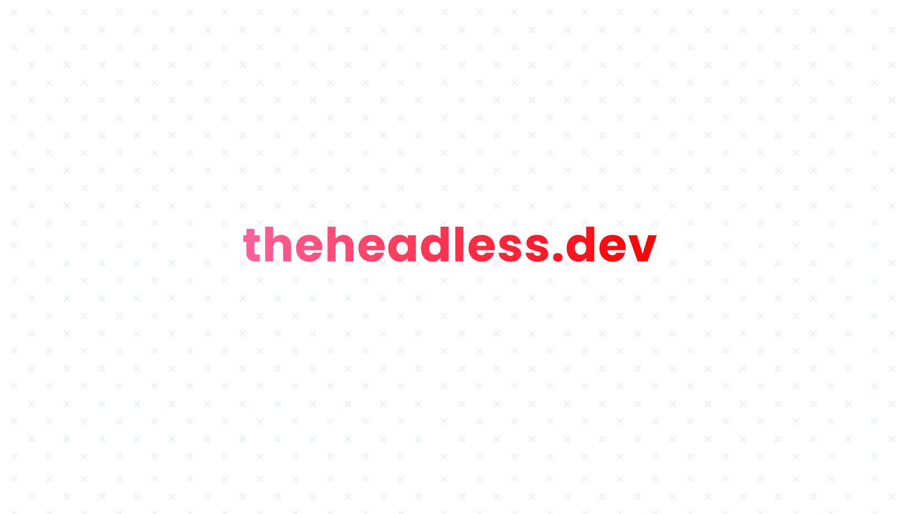

  

🖖 Hi, this is the repo with all content, code examples and the VuePress website that make up [theheadless.dev](https://theheadless.dev), a community driven knowledge base for learning headless browser automation with Puppeteer and Playwright.

You can browse [all code examples in this folder](https://github.com/checkly/theheadless.dev/tree/master/blog/snippets), or contribute your own!

Made with ♥️ by [ChecklyHQ](https://www.checklyhq.com?utm_source=headlessdevgithub)

## Contribute

We welcome new articles on Puppeteer, Playwright and any topic surrounding the practical application of modern headless browser
frameworks. [Read here how to contribute](CONTRIBUTING.md)

## Authors

- Giovanni Rago ([@rag0g](https://twitter.com/rag0g)) – [Checkly](https://www.checklyhq.com?utm_source=headlessdevgithub)
- Maxi Gimenez ([@GMaxi_](https://twitter.com/gmaxi_)) – [Checkly](https://www.checklyhq.com?utm_source=headlessdevgithubs)
- Tim Nolet ([@tim_nolet](https://twitter.com/tim_nolet)) – [Checkly](https://www.checklyhq.com?utm_source=headlessdevgithub)
- Hannes Lenke ([@hlenke](https://twitter.com/hlenke)) – [Checkly](https://www.checklyhq.com?utm_source=headlessdevgithub)

## Acknowledgements

This code uses parts of plugins and ejected themes from the Vue community:
- [https://github.com/webmasterish/vuepress-plugin-autometa](https://github.com/webmasterish/vuepress-plugin-autometa#usage)
- [https://github.com/vuepressjs/vuepress-theme-blog](https://github.com/vuepressjs/vuepress-theme-blog)
